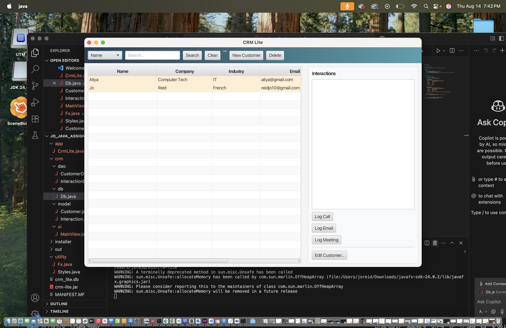

# CRM_Lite_App

**CRM Lite** is a lightweight Java desktop CRM (JavaFX + SQLite) for quick contact and follow-up management.

## Screenshot


## Features
- Search by **Name / Company / Industry**
- Store **email**, **phone**, **next follow-up**
- Log **Calls / Emails / Meetings**
- Row highlight: **orange = due soon**, **red = overdue**
- Local data file: `crm_lite.db`

## Recording (Demo Video)

A short demo video shows the app running and core features.

**What to show (suggested, ~30–60s):**
1) Launch via `crm-lite` (or Desktop icon).
2) Add a new customer with a follow-up date.
3) Log an interaction (Call/Email/Meeting).
4) Point out the due/overdue row highlight.

**Watch the demo:** [demo.mp4](media/demo.mp4)

## Requirements
- Java **17+** (tested with Java **24**)
- JavaFX SDK **24** (unzipped locally)

## Install (user-level “global” CLI)
```bash
chmod +x installer/install-user.sh
./installer/install-user.sh
# then launch from anywhere:
crm-lite
